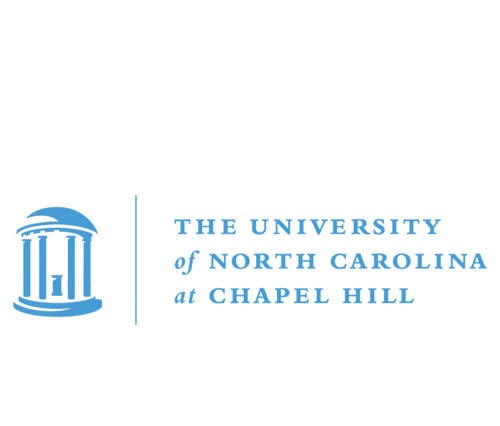
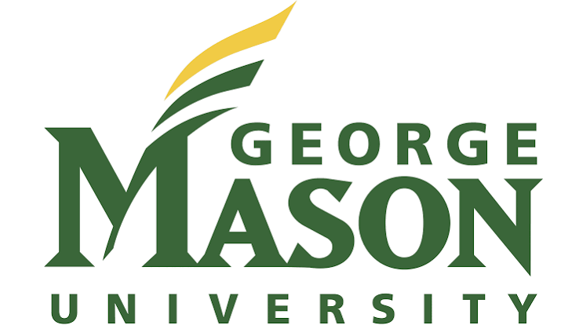

::: {.column-page}

:::: {layout = "[65, 35]" style = "align-items: flex-start; gap: 2rem; padding: 1.5rem 0 0 0;"}

::::: {.bio-text}

## Bio

I am a visiting assistant professor at Gettysburg College in the [Deparment of Psychology](https://www.gettysburg.edu/academic-programs/psychology/){target="_blank"}, where I teach courses including Introduction to Psychology, Forensic Psychology, Adulthood and Aging, and Research Methods. In my research, I use primarily behavioral (both experimental and correlational) methods to investigate the factors that influence human memory and memory errors. I also use neuroimaging (fMRI) methods to investigate the neural basis of memory in collaboration with neuroscientists in my professional network. I am passionate about incorporating open science principles such as reproducibility and transparency in my work, and frequently engage in open science practices including preregistration, material/code sharing, and sensitivity/robustness analyses. In my spare time, I enjoy cooking, playing video games, and watching horror movies.

---

:::::

{style="border-radius: 4px; width: 100%; margin-top: 5.5rem;"}

::::

:::: {layout="[65, 35]" style="align-items: flex-start; gap: 2rem; padding: 1.5rem 0 0 0;"}

::::: {}

## Education

**PhD, Cognitive Psychology | Formal Concentration in  Quantitative Psychology**
 University of North Carolina at Chapel Hill, 2023

**MA, Cognitive Psychology**
 University of North Carolina at Chapel Hill, 2020

**BS, Psychology**
 George Mason University, 2016

 

---

:::::

::::: {} 

{style="width: 85%; margin-top: -3rem;"}

{style="width: 70%;"}

:::::

::::

:::