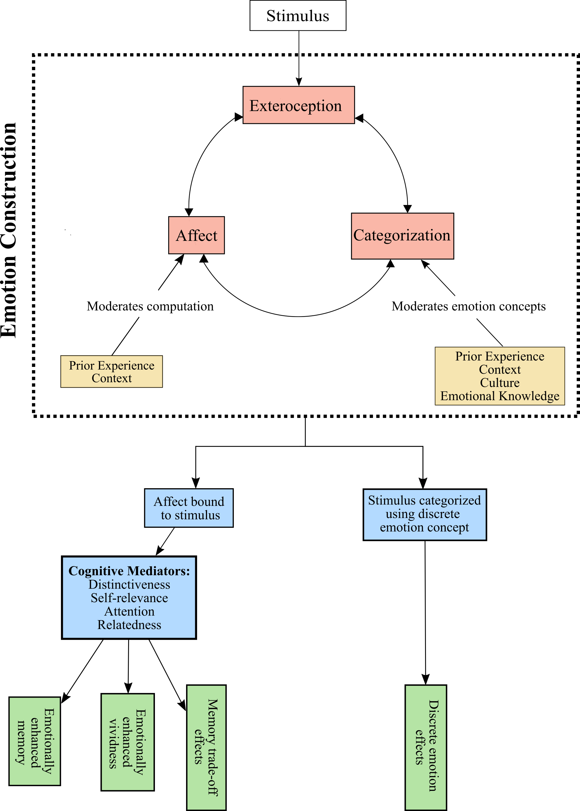
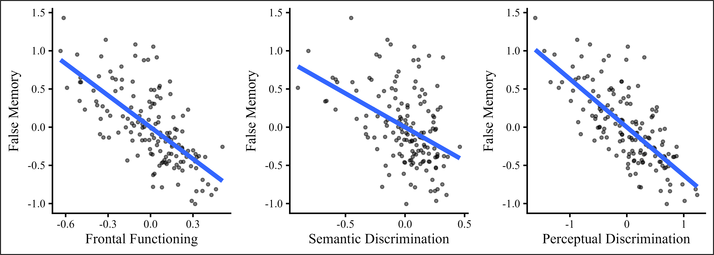
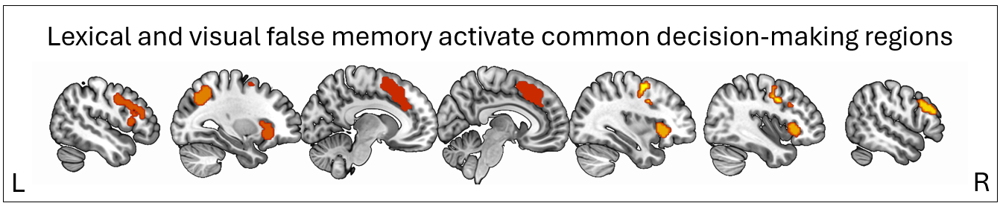
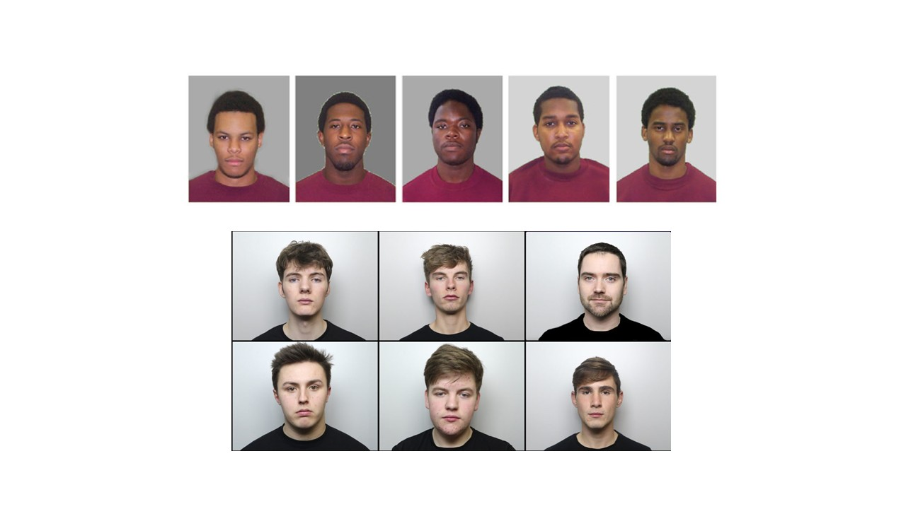
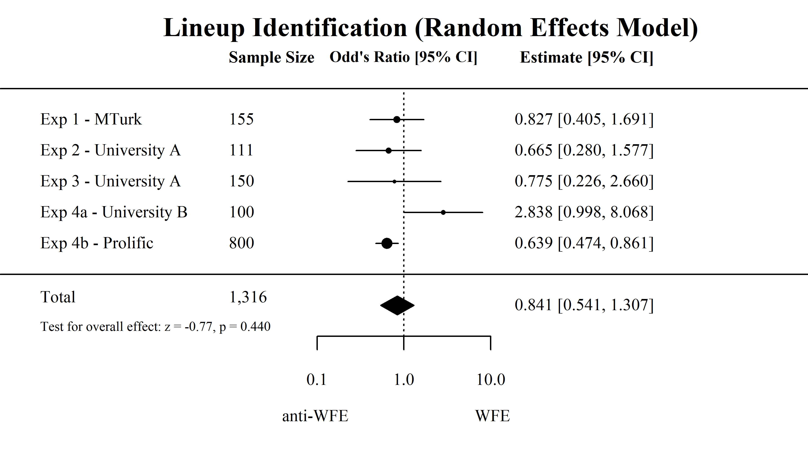

::: {.column-page}

:::: {layout = "[60, 40]" style = "align-items: flex-start; gap: 2rem; padding: 1.5rem 0 0 0;"}

::::: {}

### Emotion and Memory

How do the emotions we experience during an event affect how we remember it later? Decades of cognitive research has investigated this question, revealing important insights into how emotion impact memory outcomes including accuracy, vividness, and experiences of recollection. In my own work, I have looked to social psychology and affective science to find fresh perspectives which may be applied to the study of emotional memory rooted in longstanding theories of emotion. One such perspective, psychological constructionism, conceives of emotions as emergent mental events constructed in the moment when individuals use conceptual knowledge about specific emotions (e.g., "fear", "schadenfreude" [German], "gigil" [Tagalog]) to categorize internal affective sensations such as feelings of valence and arousal. Recently, I published a theoretical paper in [*Perspectives on Psychological Science*](https://doi.org/10.1177/17456916261425152){target="_blank"} proposing the **Constructionist Model of Emotional Memory (CMEM, pictured on the right)**, which makes several novel predictions about the effects of factors such as situational characteristics, conceptual knowledge, and culture on emotional memory. Moving forward, I look forward to testing these predictions and developing the CMEM model further.

My collaborators in this line of research include [Neil Mulligan](https://sites.google.com/view/neilmulligan/home){target="_blank"} and [Kristen Lindquist](https://www.kristenalindquist.com/){target="_blank"}.

 
 

---

:::::

::::: {} 

{style="width: 425px;"}

:::::

::::

:::: {layout = "[60, 40]" style = "align-items: flex-start; gap: 2rem; padding: 1.5rem 0 0 0;"}

::::: {}

### Aging and False Memory

[Demographic projections](https://www.prb.org/resource/fact-sheet-aging-in-the-united-states/){target="_blank"} indicate that the number of Americans aged 65 and older is expected to increase from 58 million in 2022 to 82 million by 2050, reflecting a 42% increase. In light of these unprecedented demographic changes, it is critical that scientists better understand how cognition changes with age so that we can support older adults as they navigate the aging experience.

My research on this topic has focused on investigating aging and **false memory**, where the past is remembered differently than it occurred. In this research, I have taken an individual differences approach, reflecting the vast heterogeneity that exists within the older adult population. During my postdoc at Penn State, I also leveraged neuroimaging (fMRI) methods to understand the neural basis of false memory and its correlates in older and younger adults.

My collaborators in this line of research include the members of [Nancy Dennis's CANLAB](https://canlab.la.psu.edu/){target="_blank"}. My recent work on creativity and false memory in aging was conducted in collaboration with creativity researchers [Roger Beaty](https://beatylab.la.psu.edu/){target="_blank"} and [Simone Luchini](https://www.simoneluchini.com/){target="_blank"}.

---

:::::

::::: {} 

{style="width: 425px; margin-top: 2rem;"}

{style="width: 425px; margin-top: 3rem;"}

:::::

::::

:::: {layout = "[60, 40]" style = "align-items: flex-start; gap: 2rem; padding: 1.5rem 0 0 0;"}

::::: {}

### Eyewitness Memory

Far from being a perfect recreation of the past like a photograph, human memory is instead malleable and subject to various errors and biases. In contexts where we are required to remember the past exactly as it happened, this fact of memory can have significant negative consequences. An example of one such context is seen in the legal system, where witnesses are tasked with remembering the details of witnessed crimes exactly as they occurred. Because human memory is imperfect, errors of eyewitness memory and identification have resulted in dire consequences for the accused including wrongful conviction and imprisonment. 

My own research on eyewitness memory has investigated a phenomenon known as the **Weapon Focus Effect (WFE)**, where witnesses show worse memory for the appearance of a perpetrator if the perpetrator is armed compared to unarmed. Although prior research has provided support for this effect, [my own research](https://doi.org/10.1037/law0000469){target="_blank"} demonstrates repeated pre-registered non-replications of the WFE, raising important questions about the replicability and generality of this foundation eyewitness memory phenomenon. Currently, I am conducting research as part of a consortium of forensic researchers investigating critical issues related to the WFE led by Drs. [Jonathan Fawcett](https://neurofog.ca/){target="_blank"} and [Chris Lively](https://www.stfx.ca/faculty-staff/christopher-lively){target="_blank"}.

My collaborators in this line of research include [Neil Mulligan](https://sites.google.com/view/neilmulligan/home){target="_blank"}, [Brian Bornstein](https://search.asu.edu/profile/3606958){target="_blank"}, [Jonathan Fawcett](https://neurofog.ca/){target="_blank"}, and [Chris Lively](https://www.stfx.ca/faculty-staff/christopher-lively){target="_blank"}.

---

:::::

::::: {} 

{style="width: 425px"}

{style="width: 425px; margin-top: 2rem;"}

:::::

::::

:::